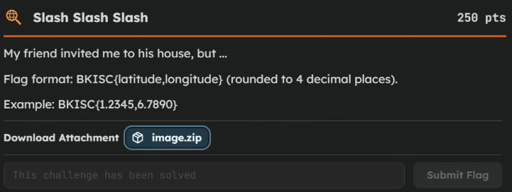

# BKISC 2026

Date: May 2, 2026

# BIKSC CTF Challenge

## OSINT challenge

- Image, it has the location of **1806/127/2/6/15/48/5 Huỳnh Tấn Phát, KP6 - Thị trấn Nhà Bè**

- Search the location on Google

- Open 3D map and search the nearby location: [https://maps.app.goo.gl/nUSipqQjLNtzGZFL9](https://maps.app.goo.gl/nUSipqQjLNtzGZFL9)
- We can see the coordinates when we choose it
- Flag: **`BKISC{10.6949,106.7353}`**

## MISC Challenge

### Challenge 1

- Investigation:
    - Here we see a duplication of values:
        - 💢
        - 😭
    - We expect it to be either Binary cipher or Morse Code
    - We try Morse Code and see that it matches the amount of symbol in a Morse code alphabet
    
    
    
    - We assume 💢 = _ and 😭 = .
- Solution:
    - ^💢😭😭😭 = B
    - ^💢😭💢 = K
    - ^😭😭 = I
    - ^😭😭😭 = S
    - ^💢😭💢😭 = C
    - 💢💢💢😭💢😭 = {
    - 😭💢💢😭 = p
    - 😭😭😭😭 = h
    - 😭😭😭😭💢 = 4
    - 😭😭 = i
    - 😭😭💢💢😭💢 = _
    - 💢😭💢😭 = c
    - 😭😭😭😭 = h
    - 😭💢💢💢💢 = 1
    - 💢😭 = n
    - 😭😭😭😭 = h
    - 😭😭💢💢😭💢 = _
    - 💢😭😭 = d
    - 💢💢💢💢💢 = 0
    - 💢😭 = n
    - 💢😭💢😭💢💢 = !
    - 💢😭💢😭💢💢 = !
    - 💢😭💢😭💢💢 = !
    - 💢💢💢😭😭💢 = }
- Flag: **`BKISC{ph4i_ch1nh_d0n!!!}`**

### Challenge 2

- Investigation:
    - The hint said that this image could be read and could be play. Meaning this file could be an .pdf file and a mp4 file
- Solution:
    - The image:
    
    
    
    - Change the extension of the file
    
    
    
    - The file now we receive is a MP4 file
    
    
    
    - Play the MP4 file and we have the first part of the flag
    
    
    
    - Continue, we change the extension of the file, and we find the last part of the flag
    
    
    
- Flag: **`BKISC{bUy_0n3_g377W0_aHh_f1lE}`**